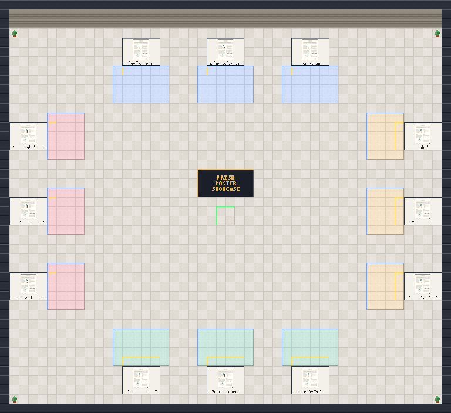

# PRISM Open Day · the WorkAdventure world

A walk-around venue for the PRISM open day, built on [WorkAdventure](https://workadventu.re).
PRISM is the Peer-vetted Research Initiative for Safety Methodologies, a sixteen-week
AI safety research fellowship run by [Women Who Do Data](https://w2d2.org).

**Play it:** https://play.workadventu.re/_/global/Women-Who-Do-Data-W2D2.github.io/prism-openday-world/maps/hall.tmj

Arrow keys or WASD to walk. Walk up to someone and your cameras connect. Stand on a poster
board and press SPACE to open the team's project page. The Directory button at the bottom
lists all twelve teams.

## The poster hall

A single 48×44-tile room with all twelve PRISM teams on four colour-coded walls.

Every poster has its own video call. The tinted floor in front of each board is that poster's call area: step onto it and you join the team's call, step off and you leave. Call areas are 6 by 4 tiles and sit at least three tiles from each other, corners included, so neighbouring conversations never overlap. `scripts/build-maps.cjs` refuses to build if two call areas come closer than that. You spawn in the middle, outside every call.

```
               ┌─────────────────────────────────┐
               │           NORTH (blue)          │
               │  Rachel    Manjari    Aviram    │
               │  Freedman  Narayan    Berg      │
       ┌───────┤                                 ├───────┐
       │       │                                 │       │
       │ Preeti│                                 │ Rubi  │
       │       │                                 │       │
  WEST │ Jobst │          (spawn point)          │Naiyar.│ EAST
 (red) │       │                                 │       │(orange)
       │Jeyash.│                                 │Ayodeji│
       │       │                                 │       │
       └───────┤                                 ├───────┘
               │  Aryan     Branwen   Zeenath    │
               │  Agarwal   Owen      Reza Khan  │
               │          SOUTH (green)          │
               └─────────────────────────────────┘
```

| Wall | Colour | Teams |
| --- | --- | --- |
| North | Blue | Rachel Freedman · Manjari Narayan · Aviram Berg |
| East | Orange | Rubi Hudson · Naiyarah Hussain · Ayodeji Ibitoye |
| South | Green | Aryan Agarwal · Branwen Owen · Zeenath Reza Khan |
| West | Red | Preeti Ravindra · Jobst Heitzig · Jeyashree Krishnan |

The map file is `maps/hall.tmj`.



## How it is made

Nothing here is drawn by hand. Three content files drive everything:

| File | What it holds |
| --- | --- |
| `content/posters.txt` | one line per poster: its PRISM track and its neurips.cc poster id |
| `content/posters.json` | what the fetch script found for each poster (title, authors, abstract, image address); regenerate, do not edit |
| `content/teams.json` | the twelve teams: mentor, title, theme, wall, position, fellows, and the paragraph on the team's page |

Scripts turn those into the world:

```
content/*  --fetch-posters-->  content/posters.json + content/posters/*.png
           --tileset-------->  tilesets/prism.png + prism.json   (floors, walls, signs, poster boards)
           --build-maps----->  maps/hall.tmj + src/world.json    (the room and zone labels)
           --build-pages---->  pages/**/*.html                   (what opens in the side panel)
           --buildmap------->  dist/                             (validated, optimised, what gets deployed)
```

## Quick start on a fresh clone

```sh
git clone https://github.com/Women-Who-Do-Data-W2D2/prism-openday-world
cd prism-openday-world
nvm use 22            # Node 20 or newer; the build tools need it
npm install
npm run posters       # fetches poster metadata and thumbnails from neurips.cc (thumbnails are not committed)
npm run content       # tileset, maps, pages
npm run buildmap      # validates every map exactly as the deploy does
```

`npm run dev` serves the maps locally. WorkAdventure's client runs on an https page and will
not load maps from `localhost`, so use an https tunnel: see [docs/HOW-TO-WORKADVENTURE.md](docs/HOW-TO-WORKADVENTURE.md).

## Changing things

| Want to | Do this |
| --- | --- |
| Change a team's name, title, wall position or blurb | edit `content/teams.json`, then `npm run content` |
| Add or update a poster thumbnail | edit `content/posters.txt`, then `npm run posters && npm run content` |
| Change the programme, about, directory or join text | edit `scripts/build-pages.cjs`, then `npm run content` |
| Move a poster, resize the room, add furniture | edit the room's function in `scripts/build-maps.cjs`: see [docs/editing-the-world.md](docs/editing-the-world.md) |
| Change what a sign says | edit `scripts/tileset.cjs`, then `npm run content` |
| Change the banners that appear as you walk in | `src/main.ts` and the `zones` block at the end of `scripts/build-maps.cjs` |

After any change: `npm run content`, run `npm run buildmap`, commit, push.

## Deploy

Push to `main`. GitHub Actions (`.github/workflows/build-and-deploy.yml`) runs `npm run build`
and publishes `dist/` to the `gh-pages` branch. The live world updates within about two minutes.
Generated files (`maps/`, `tilesets/`, `pages/`, `src/world.json`) are committed on purpose, so
the deploy needs no network access to neurips.cc.

Forks do not deploy to the live address. Work on a branch or a fork and open a pull request.

To give someone push access, the owner runs
`gh api -X PUT repos/Women-Who-Do-Data-W2D2/prism-openday-world/collaborators/<github-user> -f permission=push`
or uses Settings, Collaborators on GitHub.

## Hosting

The play address above uses WorkAdventure's free hosted plan: ten visitors at a time, unlimited
audio and video. For a bigger crowd, point a self-hosted WorkAdventure server at the same maps.
The Hetzner recipe (one small server, about 8 EUR a month) lives in the museum world repo,
`ai-safety-museum-world/hosting/`, and the play address pattern is
`https://<your host>/_/global/Women-Who-Do-Data-W2D2.github.io/prism-openday-world/maps/hall.tmj`.

## Folders

| Folder | What lives there |
| --- | --- |
| `content/` | the content files above; `posters/` holds fetched thumbnails (ignored by git) |
| `scripts/` | `fetch-posters.cjs`, `world.cjs` (walls, colours), `paint.cjs` (a tiny pixel painter and font), `tileset.cjs`, `build-maps.cjs`, `build-pages.cjs`, `postbuild.cjs` |
| `maps/`, `tilesets/`, `pages/`, `src/world.json` | generated, committed |
| `src/main.ts` | the map script: banners as you enter a zone, and the Directory button |
| `docs/` | the editing guide and the general WorkAdventure how-to |
| `.github/workflows/` | the deploy |

## Licences

Code MIT (`LICENSE.code`). Maps CC BY 4.0. The generated tileset is CC0, except the poster
thumbnails painted into it, which belong to their authors and are shown with a link back to
neurips.cc. Poster pages embed the poster image served by neurips.cc; nothing is re-hosted.
